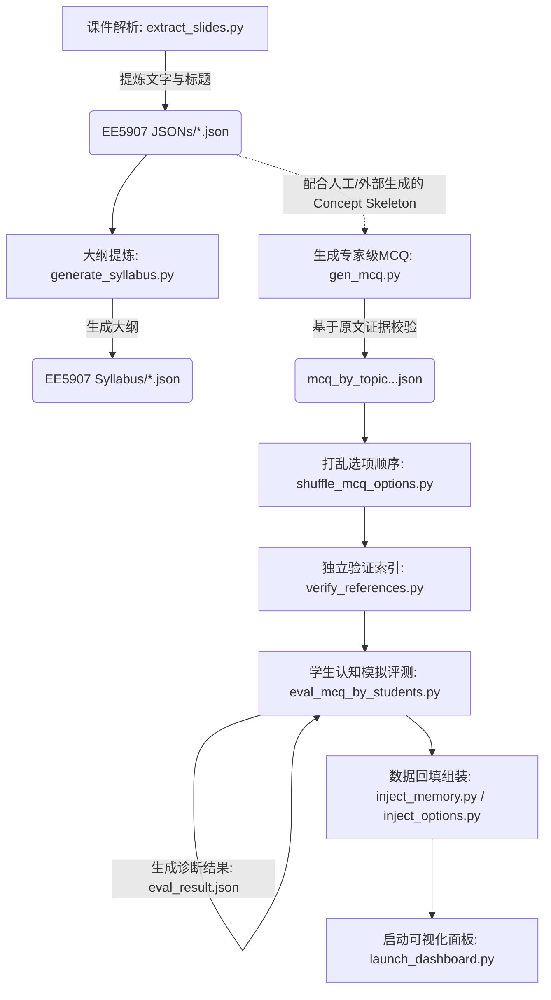

# 🎓 QBank-Agent 项目详细技术说明文档

## 🚀 快速运行指南 (Quick Start)

欢迎使用 QBank-Agent！本项目将帮你把 PDF 课件全自动转换为高质量的考题和诊断报告。只要跟着本指南，就能轻松完成整个操作流程。

### 1. 目录结构说明

在运行项目前，先了解一下核心的 `data/` 数据流目录（如果目录不存在，运行代码后会自动生成）：

- `data/input_slides/`：**起点**。把你想要用来生成题库的 PDF 课件（例如幻灯片导出的 PDF）放在这个目录下。
- `data/parsed_jsons/`：代码自动将 PDF 提取出标题和文本内容后，基础的数据模型 JSON 会保存在这里。
- `data/syllabus/`：为了更好地生成具有连贯性的题目，代码会基于第一步的 JSON 梳理课程的知识点和大纲范围，生成对应的大纲文件。
- `data/generated_mcqs/`：大模型根据大纲提取考点和证据，在这个目录下构建出初版的单选题库 (`*.mcq_by_topic_*.json`)，以及随机混淆选项后的成品题库 (`*.shuffled.json`)。
- `data/eval/`：系统会利用模拟差生、中等生、优等生的认知遗忘和解题策略（Memory Traces），重新试做刚才生成的考题，用于判断题目的区分度和可靠性，所有的诊断报告都会存放在这里。

### 2. 如何运行项目

**全局入口文件**就是根目录的 `main.py`。请确保在使用前，已经配置好虚拟环境，安装了 `requirements.txt` 中的依赖项，并且配置好了你的大模型 API 环境变量（如设置 `OPENAI_API_KEY`，或者在 `qbank_agent/config.py` 中显式填写它）。

在终端中执行以下命令：
```bash
python main.py
```

### 3. 会经历哪些阶段？(交互式与断点续传设计)

执行 `main.py` 后，程序将作为流水线顺次经历以下阶段：

1. **解析 PDF (Parsing PDFs)**：自动搜索 `data/input_slides` 里的新 PDF 并执行提取，如果系统检测到文件曾被成功解析过了会自动跳过。
2. **生成大纲 (Generating Syllabus)**：梳理提炼知识主线。同上，如果目标大纲文件已存在，就会提示“已跳过”并迅速进入下一步。
3. **生成考题 (Generating MCQs)**：这是第一个交互高光点。
   - **智能勾选菜单**：屏幕上会出现友好的互动菜单供你控制进度。你能清晰看到哪些课件是 `[✅ 已存在]` 的完成状态，哪些是 `[⏳ 待生成]` 新任务。
   - **继续与跳过机制**：工具默认会帮你把刚才没跑完的任务都勾选好。如果嫌费时间或者只想立刻跳入后面的评估流程，利用空格键勾选置顶的 `[⏭️ [全局] 跳过 MCQ 生成阶段，直接进入下一环节]` 即可。如果你强行复选了 `[✅ 已存在]`，代码会默认你想要强制覆盖，进而帮你重新生成。
4. **选项随机化验证 (Shuffling & Verifying)**：系统会自动把刚生成的题库选项 A/B/C/D 顺序打散，然后再次跑一遍幻灯片全文，检索以确信它真真切切引用了出处。
5. **智能认知评估 (Cognitive Simulation)**：最后一项高级交互。
   - **交互评估菜单**：为了保证题目难度合理、能区分“差生、普通生、尖子生”，程序会再次呈现评估选单。同样的，若只想要纯题库不需要费 token 的诊断推演，选中 `[⏭️ [全局] 跳过评估阶段，结束流程]` 直接退出大吉。

如果全程畅通无阻地“打通关”，包含大模型脑内推演与诊断日志的最终成品，将陈列在你的 `data/` 目录里！

---
## 1. 项目概述 (Project Overview)
**QBank-Agent** 是一个端到端的智能教育自动化工作流系统，旨在处理教学课件（PDF PPT），根据授课知识点自动生成具有深度推理要求、和由原文证据（Evidence）支撑的高质量选择题（MCQ）。同时，为了验证题目的区分度和诊断价值，系统采用“大语言模型扮演不同层次学生（大模型模拟认知/遗忘情况）”的方式去动态答题，并基于答题结果对题目的难易度和诊断价值进行综合评判，最后可通过前端 Dashboard 进行可视化查阅。

本项目体现了**以证据为导向的题库生成（Evidence-grounded Question Generation）**以及**基于模拟认知测试机制的质量诊断（Cognitive Simulation for Assessment Quality）**的核心理念。

---

## 2. 完整工作流程 (Complete Workflow)

系统的完整执行流程按顺序可划分为以下 7 个阶段：



### 阶段详解：
1. **数据准备与解析 (PDF 解析):** 使用 `pdfplumber` 获取 PDF 内容，利用页面顶部文字启发式提取每一页的 Title 和 Content 并组装为初级 JSON。
2. **知识大纲构建 (Syllabus):** 调用大模型根据 PPT 内容梳理出的 Title / Page Outline 生成高度精炼的关键知识点（Sub-points）和大纲。同时项目需要预定义各 Topic 关联知识结构的 `concept_skeleton.json` 文件供后续使用。
3. **基于证据的多选生成 (Evidence-Based MCQ Gen):** 这是题目生成的核心。限制大模型仅通过幻灯片真实原句（Evidence Quotes）进行创作，禁止使用跨界知识。包含防幻觉机制、多页拼接以及通过代码对生成的引用（Fuzzy-match >90%）做自动过滤和检验。如果引用对不上则通过加入错误日志，最多重试并纠正两遍 (Regen)。
4. **选项混淆 (Shuffling Options):** 获取生成的 MCQ 对象，由程序随机打乱 `A/B/C/D` 并同步修复 `answer` 值。
5. **交叉检查 (Reference Verification):** 利用 [verify_references.py](file:///d:/VScode_projects/QBank-agent/verify_references.py) 做第二次独立的严格化检查，确保所有引用的原话、字符和出处准确无误。
6. **模拟学生测试与评判 (Student Evaluation):** 利用 GPT 生成同一段文字在不同水平学习者脑海里的“退化记忆印记”，然后在剥除上下文信息的情况下控制 GPT 仅通过此片段知识答题。由答对的概率和自评估信心得出本题的“诊断有效性”。
7. **数据组装与呈现 (Data Injection & Dashboard):** 把选项、记忆痕迹回填入评测生成的 JSON 日志中，开启本地服务 `localhost:8080` 进行前端展示。

---

## 3. 关键逻辑与算法分析 (Key Logic & Algorithms)

### 3.1 专家级 MCQ 生成与代码自检验 (gen_mcq.py)
* **跨概念融合请求 (Cross-concept integration):** 强制要求大模型生成的题目能涵盖至少2个概念及其边界，禁止基于简单单词记忆（Verbatim recall）等形式的考题。对于强混淆点，错误选项（Distractor）必须合理。
* **严格证据要求与验证系统:** 每次问答必须保留 `evidence_quotes`，这些 quote 将由 Python 代码做验证。如果是精确匹配 (Exact Match) 或者忽视空白符匹配失败，则使用 Difflib 做相似度比对，只有 LCS (最长公共子串匹配率) 大于 0.9（90%匹配度）时才将题目纳入合法输出，过滤“AI 自己加工过的谎言幻觉”，保证证据可溯源性。
* **多次迭代回退机制 (Regenerate iteratively):** 如果产出的题目数量少于既定目标，将错误日志（`errs`）补充到 Prompt 中喂给大模型重做，共尝试三轮。

### 3.2 自行研判机制：不同水平的学生模拟测试 (eval_mcq_by_students.py)
该脚本逻辑极为精巧，它的评测分为**两步流 (Two-Phase)**：

* **阶段1：生成不同保真度的“记忆痕迹 (Memory Traces)”**
  系统抽取某个知识点的真实 PPT 全文提交给大模型，要求其针对三类学生吐出带有衰减的“记忆片段”：
  * **Student A (Weak Learner):** 记忆极度匮乏，上课没听，只记得一个标题或者零星不相关词汇。
  * **Student B (Partial Learner):** 一知半解，记住主要名词但不记得具体适用条件、公式细节和容易搞混的概念，最容易落入似是而非的学术陷阱中。
  * **Student C (Good Learner):** 优质吸收，极少出错，理解深刻。
* **阶段2：限制知识边界角色扮演作答**
  开启另一个大模型上下文，此时**强行限制大模型不许使用 Pre-trained Knowledge**。仅喂给其阶段一生成的寥寥两三句“Memory Trace”，让其分别扮演该水平学生解题，并必须在输出的 JSON 里给出：`Reasoning`（答题思路）、`Confidence`（做题信心）。

### 3.3 难度诊断判决矩阵 (Diagnostic Rubric)
代码中 [diagnose_question()](file:///d:/VScode_projects/QBank-agent/scripts/eval_mcq_by_students.py#310-361) 函数对题目的质量有着非常硬性的推断标准：
* 阈值设定：必须是 **答对且 Confidence $\neq$ “low”** 才能视为【真正掌握】(Mastery)，否则一律记为瞎蒙。
* 判定规则表：

| Student A 掌握 | Student B 掌握 | Student C 掌握 | 判定结果 (Diagnosis) | 原因剖析 |
| :---: | :---: | :---: | :---: | :--- |
| ✅ | ✅ | ✅ | `⚠️ 太简单` | 所有学生都能随意答对的题毫无区分度 |
| ❌ | ❌ | ❌ | `🚨 题目或证据有问题`或`🚨 表述或 evidence 不清` | 优等生也做不出，或所有人都在乱猜 (Confidence很虚) |
| ❌ | ❌ | ✅ | `✅ 非常好的诊断题` | 完美区分出了没好好学和精准掌握知识点的学生 |
| ❌ | ✅ | ✅ | `✅ 难度适中` | 中等难度题目 |
| ✅ | ❌ | ❌ | `✅ 难度适中` 或 `🚨 表述不清` | 优等生掉入陷阱但差生意外搞懂（可能是一部分误导陷阱太强）|

---

## 4. 关键数据字段模型 (Data Fields & Schemas)

为了确保各组件间的有效通讯，系统采用深层嵌套且强规范约束的 JSON 文件结构。

### 4.1 原始幻灯片解析结果 (`EE5907 JSONs/*.json`)
```json
{
  "source_file": "Lecture 1.pdf",
  "outline": ["Slide Title 1", "Slide Title 2"],
  "outline_with_page_range": [
    { "title": "Slide Title 1", "page_range": [1] }
  ],
  "slides": [
    {
      "file": "Lecture 1.pdf",
      "page": 1, 
      "title": "Welcome",
      "content": "Full extracted text content here. \n Without headers.",
      "pages": [1, 2] // Note: Content merged across pages with identical titles 
    }
  ]
}
```

### 4.2 概念生成节点结构设计骨架 (`*.concept_skeleton.json`)
指导 [gen_mcq.py](file:///d:/VScode_projects/QBank-agent/scripts/gen_mcq.py) 从哪些页码上拉取内容从而构置出 MCQ：
```json
{
  "deck_id": "Lecture 1",
  "topics": [
    {
      "topic_id": "T01",
      "topic": "Bayes Decision Theory",
      "slide_range": [10, 15],
      "concepts": [
        {
          "concept_name": "Posterior Probability",
          "supporting_slides": [11, 12]
        }
      ]
    }
  ]
}
```

### 4.3 题库生成及乱序后结果 (`*.mcq_by_topic_*.shuffled.json`)
```json
{
  "deck_id": "Lecture 1",
  "difficulty_scale": "1-3",
  "questions_per_topic": 5,
  "topics": [
    {
      "topic_id": "T01",
      "topic": "Bayes Decision Theory",
      "slide_range": [10, 15],
      "questions": [
        {
          "question_id": "Q1",
          "topic_id": "T01",
          "knowledge_tags": ["posterior", "likelihood"],
          "difficulty": 3,
          "stem": "If prior probability increases, what happens in ... ?",
          "options": {
            "A": "Distractor choice 1",
            "B": "Correct Answer string",
            "C": "Misconception choice 2",
            "D": "Out of context choice 3"
          },
          "answer": "B", 
          "rationale": "Explanation for option B correctness and why others fail...",
          "source": { "pages": [11, 12] },
          "evidence_quotes": [
             "The posterior increases monotonically with..."
          ]
        }
      ],
      "warnings": []
    }
  ]
}
```

### 4.4 核心诊断与答题输出 (`*.mcq_eval_result.json` 挂载 memory_traces 后)
这个 JSON 极其庞大且详尽记录了大模型的推理黑盒（Chain of Thought）。
```json
{
  "deck_id": "Lecture 1",
  "model": "gpt-5.2",
  "evaluation_date": "2026-03-06 10:30",
  "summary": { "total_questions": 5, "excellent_diagnostic": 2, "moderate_difficulty": 3, "too_easy": 0 ... },
  "topics": [
    {
      "topic_id": "T01",
      "results": [
        {
          "question_id": "Q1",
          "stem": "Which of the following...",
          "correct_answer": "B",
          "difficulty": 3,
          "source_page": [11, 12],
          "diagnosis": "✅ 非常好的诊断题",
          
          // 回填的 Memory Traces 对象
          "memory_traces": {
            "student_A": ["I think the slide had some formula but I don't know."],
            "student_B": ["Posterior is proportional to likelihood. I forget the denominator."],
            "student_C": ["Posterior = (Likelihood * Prior) / Evidence. Evidence is sum of joint probabilities."]
          },

          // C 类优质学生解题复现日志
          "student_C": {
             "memory_reflection": "I distinctly remember Posterior = (Likelihood * Prior)...",
             "option_analysis": {
                 "A": "Incorrect because...",
                 "B": "Correct under assumption..."
             },
             "reasoning": "Synthesizing my good memory, option B perfectly holds...",
             "confidence": "high",
             "selected_option": "B"
          },

          // A、B类学生的解题复现同上, 且包含各自受限记忆情况下的强推断结论...

          // 重新回注的选择支对象
          "options": { "A": "...", "B": "..." }
        }
      ]
    }
  ]
}
```

---

## 6. 项目拓展与优化建议
基于目前的代码层结构，有几项可参考改进：
1. **并行处理优化 (Parallel Execution):** [eval_mcq_by_students.py](file:///d:/VScode_projects/QBank-agent/scripts/eval_mcq_by_students.py) 和 [gen_mcq.py](file:///d:/VScode_projects/QBank-agent/scripts/gen_mcq.py) 在针对每道题以及扮演每类学生解答时使用的是同步阻塞请求（Sequential Blocking Calls）。建议引入 `asyncio` 改造为并发请求批量调度大模型，从而大幅缩短评测的整体时长。
2. **长距版面依赖解耦 (Vision-based Parsing):** [extract_slides.py](file:///d:/VScode_projects/QBank-agent/extract_slides.py) 当前采用极其基础的解析算法（高度小于某个长度阈值即视为标题等启发式判断）。面对公式较多、边界或者副标题混乱的进阶版 PPT 学术图表时可能发生串位。后期推荐使用专业的 PDF 视觉解析库乃至 MLLM 预解析提取干净的全文。
3. **日志框架升级 (Logging Framework):** 目前各类 API 中断或警告多用 `print` 和报错抛至工作台输出 (`last_err`)，建议整体替换为更严谨的 Python 原生 `logging` 模块以便在长期批处理任务中可以回查历史节点中的超时记录。
